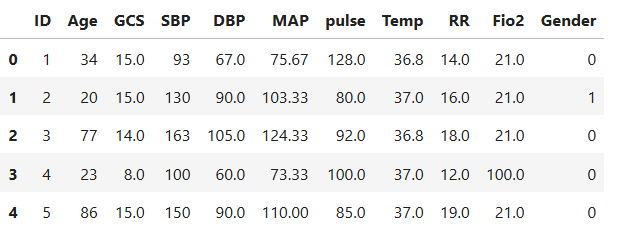
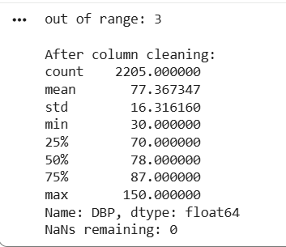
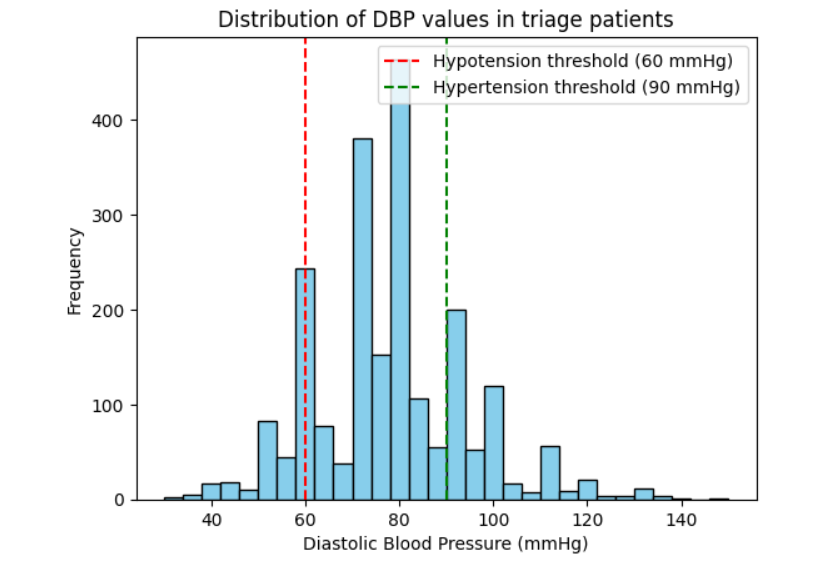
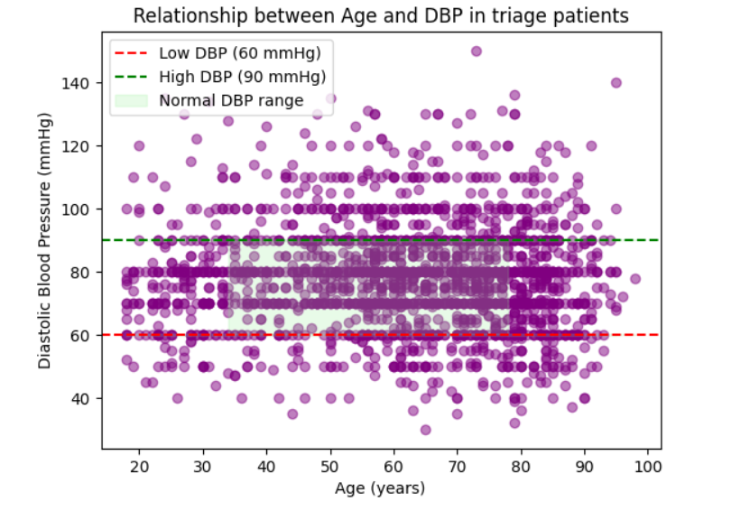

# carisurg-portfolio

### Overview
---

---

Week 0 - Assignment 1

## Assignment 1 (Gender Column Cleaning)

Assignment 1 focused on cleaning the `Gender` column in a dataset for Mercer General Hospital’s Clinical AI & Innovation Unit. The purpose of the activity was to demonstrate the importance of data cleaning and preprocessing before performing analysis or using machine learning models. The dataset used was *EmergencyTriageDataset_Reduced_Dirty.csv*, where the `Gender` column contained inconsistent values that could lead to inaccurate results if left uncleaned.

The following mappings were used to standardize the data:

1. `Male`, `MALE`, and `1` were converted to `1`
2. `Female`, `FEMALE`, and `0` were converted to `0`

This cleaning process improved consistency, reduced errors, and made the dataset more reliable for analysis. It also showed how differences in capitalization, numeric values, and missing data can affect data quality. Clear and readable Python code was used to load the CSV file, clean the `Gender` column, and document each step so the process could be easily understood and repeated.

## Gender Column Cleaning Output

## Assignment 2: DBP Cleaning Output

---
Week 0 - Assignment 2

## Assignment 2: Advanced Cleaning (DBP Column)

## Overview

I chose the **DBP (Diastolic Blood Pressure)** column for cleaning. DBP represents the pressure in the arteries when the heart rests between beats and is important for accurate clinical analysis and MAP calculations. The DBP column was selected because accurate diastolic blood pressure values are essential for patient assessment and reliable analysis results.

## What Was Done and Why

* Imported `pandas` and `numpy` for data handling and numerical operations.
* Loaded the dataset from Google Drive using its file ID for reliable access in Colab.
* Defined physiological DBP limits (`30–150 mmHg`) to identify unrealistic values.
* Converted DBP values to numeric using `errors='coerce'`, replacing invalid entries with `NaN`.
* Replaced out-of-range values with `NaN` because they are not clinically valid.
* Imputed missing values using the median, since it is resistant to outliers.
* Printed the number of corrected outliers, summary statistics, and remaining `NaN` values to verify successful cleaning.

This approach demonstrates correct handling of invalid data, clinical understanding through the use of realistic physiological limits, and readable code through clear variable names and concise outputs.

## DBP Cleaning Output

## Assignment 2: DBP Cleaning Output

---
Week 0 - Assignment 3

### Assignment 3: Basic Data Visualisation with matplotlib

## Overview

For this exercise, **Diastolic Blood Pressure (DBP)** was analyzed alongside **Age** because both are important indicators of cardiovascular health. The dataset was successfully loaded into a pandas DataFrame and cleaned by correcting invalid values and replacing missing data where necessary. Descriptive statistics were generated using the `.describe()` function to summarize the dataset and confirm that values fell within expected clinical ranges.

### Visualizations

* **Histogram of DBP:** Used to show the distribution of DBP values across the dataset. Reference lines at **60 mmHg** and **90 mmHg** indicate hypotension and hypertension thresholds, helping identify patients outside the normal DBP range.

* **Scatter Plot of DBP vs Age:** Used to examine the relationship between Age and DBP. Reference lines and a shaded normal range were included to support interpretation and identify age groups with abnormal DBP values.

The notebook was organized into clear sections with consistent indentation, descriptive variable names, and comments explaining each step of the analysis.

---

Week 0 - Assignment 4

### Assignment 4: Vital Signs Report

## Overview

This section provides an introduction to Systolic Blood Pressure (SBP) as a key vital sign used in clinical assessment. It outlines what SBP measures, why it is important in healthcare settings, and how it is used to evaluate a patient’s cardiovascular status. The overview also summarises normal, low, and high SBP ranges and explains the clinical significance of abnormal readings, including conditions such as hypotension, hypertension, and hypertensive crisis. In addition, it describes how SBP is typically measured in clinical practice and highlights its role in supporting triage decisions and urgent patient care prioritisation.

---

Week 0 - Assignment 5

### Assignment 5: Another Unconsidered Vital Signs Report

## Overview

This section explains Oxygen Saturation (SpO₂) as a key vital sign used in clinical practice to assess a patient’s oxygenation status. It describes what SpO₂ measures, how it is obtained using a pulse oximeter, and why it is important in both routine observations and emergency care. The overview outlines normal and abnormal SpO₂ ranges, including levels that indicate mild hypoxaemia, clinically significant hypoxaemia, and severe respiratory failure. It also highlights the clinical importance of SpO₂ in identifying patient deterioration and supporting triage decisions, particularly when interpreted alongside other vital signs.

