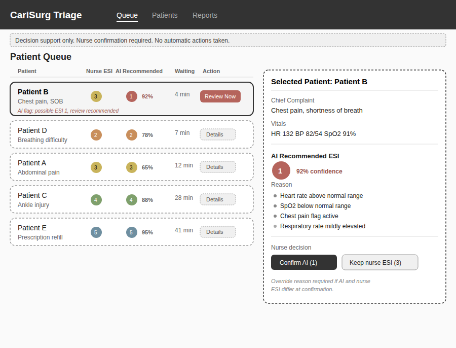

# Co-Design Canvas - CariSurg Triage AI 

Two deployment settings are being considered for the logistic regression triage model developed in the previous weeks. This document outlines the problem space for both settings, provides a full co-design canvas for the preferred implementation (HCI – ED Triage Desk), and includes a draft problem-space canvas for the secondary implementation (HRI – Observation Unit).

---

## 1. Problem Space - Both Settings

### Setting A: HCI - Main ED Triage Desk (Screen-Based, Nurse-Facing)

**Who is the user?**
The primary user is the triage nurse, who performs the patient's initial assessment when they arrive at the Emergency Department.

**What data does the model receive?**
The model receives manually entered vital signs (heart rate, blood pressure, respiratory rate, oxygen saturation, temperature, and blood glucose where available) together with the patient's chief complaint. These are entered by the nurse during the normal triage assessment.

**What does the model emit?**
The logistic regression model predicts an Emergency Severity Index (ESI) level from 1–5. The recommendation is displayed as a colour-coded indicator with an accompanying confidence score and a short explanation highlighting the vital signs or symptoms that most influenced the prediction.

**What does the human do next?**
The nurse compares the AI recommendation with their own clinical assessment. If both agree, triage continues as normal. If they differ, particularly when the model suggests a possible ESI-1 patient, the nurse reviews the explanation before confirming or overriding the recommendation. Any override is recorded for audit purposes.

### Setting B: HRI - Observation Unit (Kiosk with Robot-Assisted Vitals Station)

**Who is the user?**
The kiosk is used by Observation Unit patients to complete routine assessments, while nurses monitor alerts generated by the system.

**What data does the model receive?**
The model receives continuous vital-sign measurements from the robot-assisted monitoring station, including blood pressure, oxygen saturation, pulse rate, and temperature, together with the patient's chief complaint entered through the kiosk.

**What does the model emit?**
The system produces colour-coded visual alerts and an audio notification for nurses when signs of deterioration are detected. Patients receive simple on-screen instructions, such as remaining seated while staff are notified.

**What does the human do next?**
The nurse reviews the patient's observations, reassesses the patient where necessary, and determines the appropriate care pathway. The kiosk does not make clinical decisions or initiate patient movement on its own.

---

## 2. HCI vs HRI Safety Comparison

### HCI-Specific Safety Considerations
1. **Alarm fatigue** - frequent AI notifications may cause important alerts to be ignored if they occur too often.
2. **Display readability under pressure** - information must remain clear and easy to interpret during busy shifts, with high-contrast colours, readable fonts, and labels that do not rely on colour alone.
3. **Automation bias** - nurses may place too much trust in AI recommendations during periods of high workload, making it important that the system supports rather than replaces clinical judgement.

### HRI-Specific Safety Considerations
1. **Physical safety** - robot-assisted equipment must safely operate around patients and immediately stop if an obstacle or person is detected.
2. **Reliable interaction** - voice or touchscreen input must remain usable despite background noise, patient stress, or limited mobility.
3. **Graceful degradation** - if sensors fail or readings cannot be collected, the system must clearly indicate missing data instead of generating unreliable recommendations.

---

**Figure 1. HCI Mock-up – ED Triage Desk Interface**

Figure 1 shows the proposed HCI interface integrated into the existing ED triage workflow. The AI recommendation appears alongside the nurse's manual ESI assessment, allowing the nurse to review the confidence score and supporting rationale before confirming or overriding the recommendation.

*The percentages are the AI confidence which reflects certainty in the recommended ESI level for each patient and is not a measure of patient severity or priority.*
---

## 3. Full Co-Design Canvas - HCI: ED Triage Desk (Preferred Implementation)

### Problem
The logistic regression triage model developed during Weeks 6–8 is intended to support, rather than replace, the triage process. Nurses currently assign ESI levels manually while managing a high patient volume and limited time. One of the biggest risks in the current workflow is failing to identify critically ill patients quickly enough. The AI system provides a second opinion during triage by displaying a predicted ESI level alongside the nurse's assessment. This helps identify patients who may require immediate attention while ensuring the final decision always remains with the nurse.

### Ethics
The system is designed as a clinical decision-support tool rather than an autonomous decision-maker. Nurses remain responsible for the final triage decision, and all overrides are recorded to maintain accountability.

The interface should minimise automation bias by making it just as easy to disagree with the AI recommendation as it is to accept it. The reasoning behind each prediction should always be visible so that nurses understand why a recommendation was made.

The model excludes demographic variables such as race, ethnicity, and insurance status, although periodic bias reviews should still be performed to monitor for indirect bias through correlated clinical features.

Patient information must remain confidential and comply with hospital privacy and security requirements.

### Guidelines
- Use the existing ESI colour scheme already familiar to ED staff.
- Follow hospital information security policies when displaying patient information.
- Use high-contrast colours with text labels so urgency is not communicated by colour alone.
- Ensure fonts and buttons remain easy to read and use while wearing gloves.
- Use a minimum 16–18 pt font size, support keyboard navigation where appropriate, and ensure colour is never the only indicator of urgency. This helps meet accessibility (WCAG-aligned) requirements for clinical interfaces.
- Display AI recommendations within approximately two seconds of completing data entry so they do not delay triage.

### MVP
The minimum viable product adds an **AI Recommended ESI** indicator beside the nurse's existing manual ESI field. Selecting the recommendation opens a panel displaying the confidence score and the most influential vital signs or symptoms used by the model. The interface clearly states that nurse confirmation is required before any decision is recorded, and no automatic actions are taken.

### Environment
The system will operate in a busy Emergency Department where interruptions, background noise, and time pressure are common. Existing workstations already run the hospital's electronic health record (EHR) system, so the AI should appear as an additional panel rather than a separate application.

The interface should remain usable under bright lighting conditions, support staff wearing gloves, and clearly notify users if the AI recommendation is unavailable because of missing data or network interruptions.

### Form
The preferred implementation is a web-based interface integrated into the hospital's existing triage software. Using existing desktop workstations avoids introducing additional hardware while allowing the AI model to fit naturally into the current workflow.

---

## 4. Draft Canvas - HRI: Observation Unit (Secondary Implementation)

### Problem
Patients in the Observation Unit may spend extended periods waiting between routine nursing assessments. A robot-assisted kiosk could collect vital signs more frequently and identify possible deterioration earlier, allowing nurses to respond more quickly when required.

However, the system should not replace face-to-face clinical assessment. It must also be suitable for patients who may have difficulty using a kiosk independently, including elderly patients, those with mobility or cognitive impairments, or individuals unfamiliar with the technology.

