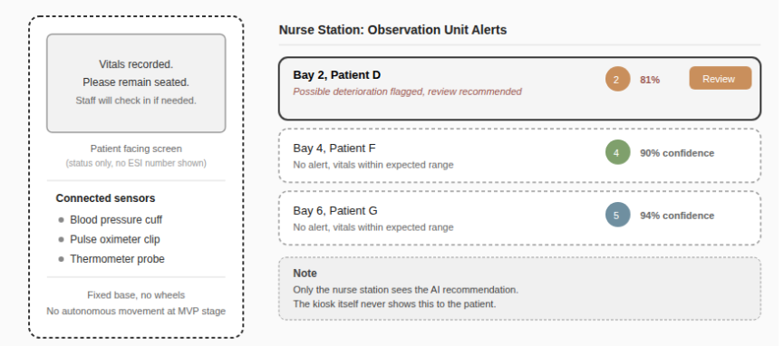

# Problem Space Both Settings

| Problem Space | Setting A - HCI: Main ED Triage Desk (Screen-Based, Nurse-Facing) | Setting B - HRI: Observation Unit (Stationary Observation Kiosk) |
|---|---|---|
| **Who is the user?** | The primary user is the triage nurse, who performs the patient's initial assessment upon arrival at the Emergency Department. | Patients in the Observation Unit use the stationary kiosk to complete routine monitoring while nurses supervise alerts and patient status from the nursing station. |
| **What data does the model receive?** | Manually entered vital signs (heart rate, blood pressure, respiratory rate, oxygen saturation, temperature, and blood glucose where available) together with the patient's chief complaint. | Continuous vital-sign measurements (blood pressure, oxygen saturation, pulse rate, and temperature) collected through integrated monitoring devices, together with the patient's chief complaint entered via the touchscreen. |
| **What does the model emit?** | A predicted Emergency Severity Index (ESI) level (1-5), displayed with a colour-coded urgency indicator, confidence score, and a brief explanation highlighting the most influential clinical features. | Colour-coded alerts and nurse notifications when patient deterioration is detected. Patients receive simple on-screen status messages, while detailed AI recommendations are displayed only at the nursing station. |
| **What does the human do next?** | The nurse compares the AI recommendation with their own clinical assessment. If they differ, the nurse reviews the explanation before accepting or overriding the recommendation. All overrides are recorded for audit purposes. | The nurse reviews alerts, reassesses the patient where necessary, and determines the appropriate care pathway. The kiosk supports monitoring only and does not make clinical decisions or initiate patient care independently. |

---

# HCI vs HRI Safety Comparison

| HCI-Specific Safety Considerations | HRI-Specific Safety Considerations |
|---|---|
| **Alarm fatigue** - frequent AI notifications may cause important alerts to be ignored if they occur too often. | **Physical safety** - the stationary kiosk must be securely positioned, with safe cable management and unobstructed access for patients and staff. |
| **Display readability under pressure** - information must remain clear and easy to interpret during busy shifts, with high-contrast colours, readable fonts, and labels that do not rely on colour alone. | **Reliable interaction** - voice or touchscreen input must remain usable despite background noise, patient stress, or limited mobility. |
| **Automation bias** - nurses may place too much trust in AI recommendations during periods of high workload, making it important that the system supports rather than replaces clinical judgement. | **Graceful degradation** - if sensors fail or readings cannot be collected, the system must clearly indicate missing data instead of generating unreliable recommendations. |

---

# Figure 1. HCI Mock-up - ED Triage Desk Interface

Figure 1 shows the proposed HCI interface integrated into the existing ED triage workflow. The AI recommendation appears alongside the nurse’s manual ESI assessment, allowing the nurse to review the confidence score and supporting rationale before confirming or overriding the recommendation.

---

# 3. Full Co-Design Canvas - HCI: ED Triage Desk (Preferred Implementation)

## Problem

The logistic regression triage model developed during Weeks 6-8 is intended to support, rather than replace, the triage process. Nurses currently assign ESI levels manually while managing a high patient volume and limited time.

One of the biggest risks in the current workflow is failing to identify critically ill patients quickly enough. The AI system provides a second opinion during triage by displaying a predicted ESI level alongside the nurse’s assessment. This helps identify patients who may require immediate attention while ensuring the final decision always remains with the nurse.

---

## Ethics

The system is designed as a clinical decision-support tool rather than an autonomous decision-maker. Nurses remain responsible for the final triage decision, and all overrides are recorded to maintain accountability.

Moreover, the interface should minimise automation bias by making it just as easy to disagree with the AI recommendation as it is to accept it. The reasoning behind each prediction should always be visible so that nurses understand why a recommendation was made.

The model excludes demographic variables such as race, ethnicity, and insurance status, although periodic bias reviews should still be performed to monitor for indirect bias through correlated clinical features.

Patient information must remain confidential and comply with hospital privacy and security requirements.

---

## Guidelines

- Use the existing ESI colour scheme already familiar to ED staff.
- Follow hospital information security policies when displaying patient information.
- Use high-contrast colours with text labels so urgency is not communicated by colour alone.
- Ensure fonts and buttons remain easy to read and use while wearing gloves.
- Use a minimum 16-18 pt font size, support keyboard navigation where appropriate, and ensure colour is never the only indicator of urgency. This helps meet accessibility (WCAG-aligned) requirements for clinical interfaces.
- Display AI recommendations within approximately two seconds of completing data entry so they do not delay triage.

---

## MVP

The minimum viable product adds an **AI Recommended ESI** indicator beside the nurse’s existing manual ESI field.

Selecting the recommendation opens a panel displaying the confidence score and the most influential vital signs or symptoms used by the model.

The interface clearly states that nurse confirmation is required before any decision is recorded, and no automatic actions are taken.

---

## Environment

The system will operate in a busy Emergency Department where interruptions, background noise, and time pressure are common.

Existing workstations already run the hospital’s electronic health record (EHR) system, so the AI should appear as an additional panel rather than a separate application.

The interface should remain usable under bright lighting conditions, support staff wearing gloves, and clearly notify users if the AI recommendation is unavailable because of missing data or network interruptions.

---

## Form

The preferred implementation is a web-based interface integrated into the hospital’s existing triage software.

Using existing desktop workstations avoids introducing additional hardware while allowing the AI model to fit naturally into the current workflow.

---

# Figure 2. HRI Mock-up - Observation Unit Kiosk

Figure 2 shows the stationary kiosk concept and the paired nurse-station alert view it feeds into. The patient never sees a raw ESI number or alert; only the nurse station receives the recommendation, consistent with the Ethics section below.

---

# 4. Full Co-Design Canvas - HRI: Observation Unit

## Problem

Patients in the Observation Unit may spend extended periods waiting between routine nursing assessments.

A robot-assisted kiosk could collect vital signs more frequently and identify possible deterioration earlier, allowing nurses to respond more quickly when required.

However, the system should not replace face-to-face clinical assessment. It must also be suitable for patients who may have difficulty using a kiosk independently, including elderly patients, those with mobility or cognitive impairments, or individuals unfamiliar with the technology.

Unlike the ED desk, where a nurse enters data once at a single point in time, this setting involves a continuous stream of vitals from a device sitting physically next to the patient, which raises a different set of design questions than a screen a nurse chooses to look at.

---

## Ethics

- **Consent and comfort around a physical device:** Patients must be able to see, understand, and where appropriate decline interaction with the kiosk or its sensors. Confused or anxious patients should never be startled by an unexplained device measuring them.
- **Dignity over surveillance:** Continuous monitoring must supplement, not substitute for, human contact. If nurse rounds became less frequent because “the kiosk is watching,” patients could reasonably feel monitored rather than cared for. This is a distinct risk from the HCI setting, where the AI recommendation is only ever seen by staff.
- **Continuous data retention:** The HCI setting captures a single manual entry per assessment; this setting streams vitals continuously, which raises separate questions about how long that stream is stored and who can access it, beyond the governance already described for manually entered data.
- **Accountability for a physical device:** Clinical staff remain responsible for supervising the kiosk and responding to alerts. The kiosk provides monitoring support only and cannot make clinical decisions independently.

---

## Guidelines

- Ensure the kiosk remains securely installed, easy to disinfect, and accessible to patients with different mobility levels.
- Kiosk touchscreens must support a large-text, simplified mode, plus a nurse-assisted entry path for patients who cannot self-operate the device.
- Voice interaction, if used, must degrade gracefully to touch input if recognition fails in a noisy bay, consistent with the HRI-specific safety consideration on this in Section 2.
- The kiosk must be positioned within sight of the nurse station so a patient is never left in a machine-only interaction with no visible staff presence.

---

## MVP

The MVP is a stationary kiosk, not a mobile robot, positioned at each Observation Unit bay.

It connects standard vitals sensors (BP cuff, pulse oximeter, thermometer) to the same underlying model used at the ED desk.

The patient-facing screen shows only a calm status message (for example, “Vitals recorded. Staff will check in if needed.”) and never displays a raw ESI number to the patient.

A colour-coded alert, described in Section 1, is shown at the nurse station instead.

No autonomous movement or care action is taken at the MVP stage; mobility is deliberately deferred to a later phase pending a dedicated safety review.

---

## Environment

- The Observation Unit bay is quieter than the main ED but still shares space with other patients, so any alert must be directed to the nurse station rather than sounding at the kiosk itself, which could distress neighbouring patients.
- Patients here are frequently resting or drowsy; the kiosk cannot assume the patient is alert or able to respond promptly.
- The kiosk equipment needs reliable power and a stable connection back to the same system used at the ED desk, since a dropped connection here means a gap in continuous monitoring rather than a single missed entry.
- Sensors that contact the patient (cuff, probe) must follow the same infection-control protocols as the equipment they replace.

---

## Form

A stationary bedside kiosk with integrated vital-sign sensors, screen-based touchscreen for chief-complaint entry, and the sensor set described above.

No mobility or robotic movement at this stage.
